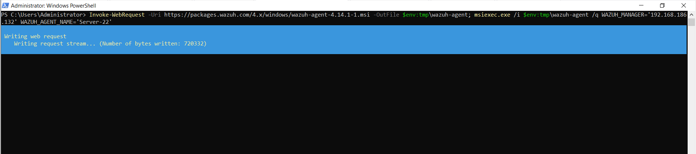
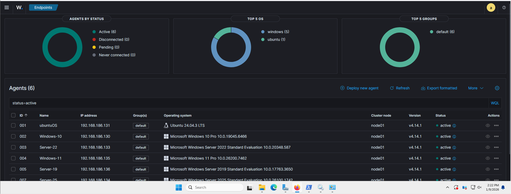

# SOC Lab Setup

This section documents the design and setup of my Security Operations Center (SOC) lab environment.

## Objectives
- Build a realistic SOC lab environment
- Simulate attacks and collect security logs
- Practice detection, alerting, and incident response workflows

## Lab Components
- Kali Linux (attack simulation)
-Wazuh Manager: Ubuntu Server (version)
	•	Wazuh Dashboard: Windows Server 2025
	•	Windows Endpoints:
	•	Windows 11
	•	Windows 10
	•	Windows Server 2019
	•	Windows Server 2022
	•	Windows Server 2025
	•	Linux Endpoint: Ubuntu 
- Wazuh SIEM (log collection, correlation, and alerting)
- Virtualization (VMware / VirtualBox)

## Architecture Overview
The lab is designed to simulate an enterprise environment where endpoint logs are forwarded to a SIEM for monitoring and analysis.

## Skills Demonstrated
- SOC architecture design
- Log collection and analysis
- Security monitoring
- Documentation and reporting

### The virtual machines used in this lab were pre-provisioned as part of an existing home lab. This phase focuses on integrating these systems into the SOC environment via Wazuh agent enrollment and validating log ingestion.

# Phase 2: Lab Setup & Agent Enrollment

## Overview
This phase documents the deployment of Wazuh agents across multiple endpoints and verifies successful log ingestion into the SIEM.

## Environment
- Wazuh Manager: Ubuntu Server
- Dashboard Access: Windows Server 2025
- Endpoints:
  - Windows 10
  - Windows 11
  - Windows Server 2019
  - Windows Server 2022
  - Ubuntu Linux

## Agent Deployment
Wazuh agents were installed on all endpoints using official Wazuh packages.
Each agent was configured to communicate with the Wazuh Manager over secure channels.

## Verification
Successful enrollment was verified through:
- Active agent status on the Wazuh dashboard
- Log ingestion from both Windows and Linux systems

Screenshots below provide evidence of agent installation and active communication.

### Ubuntu Agent Installation

### Ubuntu Agent Start-Up

### Windows Agent Installation

### Wazuh Dashboard – Active Agents

